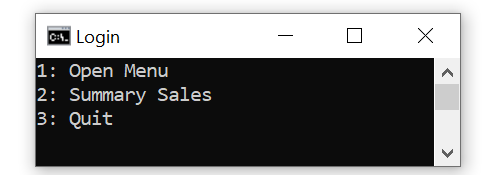
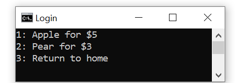
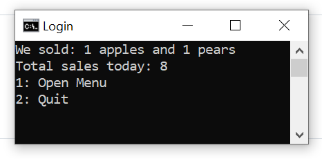

<h1 align ="center"> <strong>Simple-Ordering-Menu</strong> </h1>
<h2 align ="center"> AUTHOR: LE THIEN AN TRAN </h2>
<h3 align ="left"> <strong> 1. About it </strong> </h3>

 This is a simple console that I practice during my free time when I was a freshman. I was ordering doordash and really like their UX, then I came up with the idea of "Hmm why can't I practice programming and my user the same experience as I had". Therefore I made this.
  This program can be used by customers and the sellers.  
  When starting the program, the Home Menu with two options will appears to the users. 
  <ul>
    <li>
      The first option is for customers to buy food through the <em>"Open Menu"</em> option.  </li>
    <li>The second option is for sellers to check the amount of food was sold and sales of the day.</li></ul> 

<h3> <strong> 2. What I have learned </strong> </h3>

1. The importants of input and output  
2. Creating and using methods  
3. Looping and exiting which allows users to exit whenever they want  
4. Simple concept about User Experience.

  
<h3> <strong> 3. Cool screenshots of how it works: </strong> </h3>

 
<h4> Main Menu </h4>

<h4> Fruit Menu </h4>

<h4> Summary Menu </h4>

